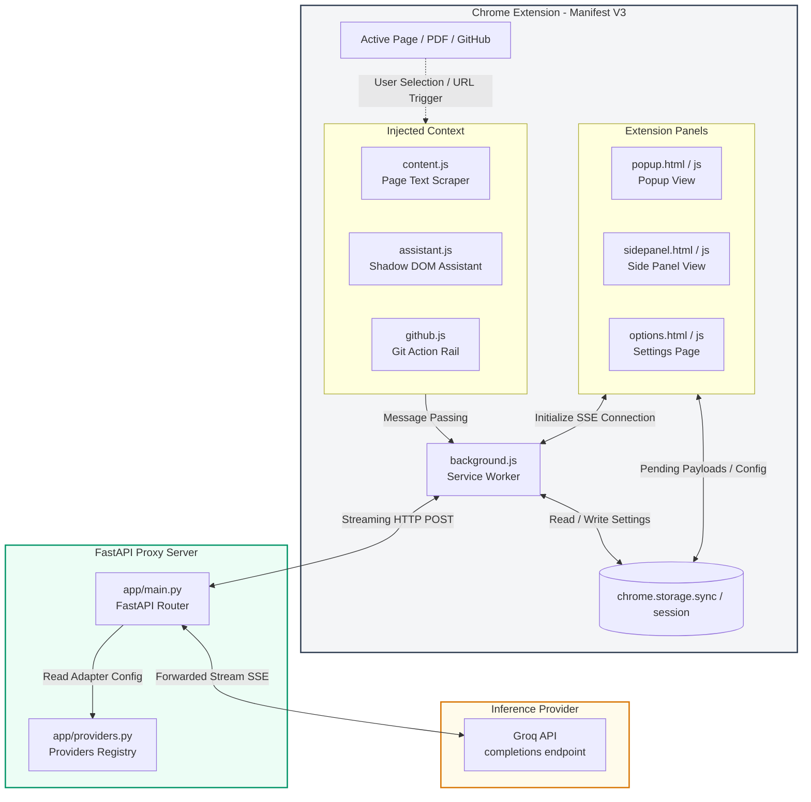

# 🤖 Chat With This Page

<p align="center">
  <a href="https://developer.chrome.com/docs/extensions/mv3/intro/">
    
  </a>
  <a href="https://fastapi.tiangolo.com/">
    
  </a>
  <a href="https://www.docker.com/">
    
  </a>
  <a href="https://groq.com/">
    
  </a>
  
</p>

---

**Chat With This Page** is a state-of-the-art Chromium extension (Manifest V3) backed by a secure FastAPI proxy. It allows you to interact with, search, and analyze any webpage, PDF document, or GitHub repository in real time using high-performance Large Language Models (LLMs) via the Groq API. 

The extension offers a premium side panel and popup experience, in-context smart search with visual scrolling/flashing highlights, a styling-isolated floating assistant, and a specialized **GitHub Mode** designed to accelerate repository navigation and code comprehension.

---

## 🗺️ Table of Contents

- [🚀 Key Features](#-key-features)
  - [💬 In-Context Chat Panel](#-in-context-chat-panel)
  - [🔎 Smart Search & Visual Jumping](#-smart-search--visual-jumping)
  - [📚 CORS-Bypassed Smart PDF Reader](#-cors-bypassed-smart-pdf-reader)
  - [✨ Highlight Context Assistant](#-highlight-context-assistant)
  - [🐙 Intelligent GitHub Mode](#-intelligent-github-mode)
  - [🖱️ Context Menu Integration](#-context-menu-integration)
- [🏗️ System Architecture & Data Flow](#️-system-architecture--data-flow)
- [📁 Repository Structure](#-repository-structure)
- [📋 Prerequisites](#-prerequisites)
- [🛠️ Local Development Setup](#️-local-development-setup)
  - [1. Backend Server Setup](#1-backend-server-setup)
  - [2. Chrome Extension Installation](#2-chrome-extension-installation)
- [⚙️ Configuration & Environment](#️-configuration--environment)
- [💡 Usage Guide](#-usage-guide)
- [🧪 Testing Suite](#-testing-suite)
- [🚢 Deployment](#-deployment)
- [⚠️ Limitations & Security Guidelines](#️-limitations--security-guidelines)
- [📄 License](#-license)

---

## 🚀 Key Features

### 💬 In-Context Chat Panel
* **Smart Context Extraction**: Extracts and formats the core text content of your active tab, feeding it automatically as system context to the LLM.
* **Real-time Streaming**: Utilizes Server-Sent Events (SSE) to deliver responses token-by-token with zero buffering.
* **Per-Page History Retention**: Conversations are automatically stored and mapped to their specific URL. Switching tabs or closing/reopening pages seamlessly restores the conversation history.

### 🔎 Smart Search & Visual Jumping
* **AI-Powered Locating**: Ask questions about details on the page (e.g. *"Where does it mention the refund policy?"*), and the AI will locate the exact content.
* **Multi-Tiered Matcher**: Falls back across exact strings, semantic clauses, sliding word windows, and single text nodes to resolve layout boundaries (e.g. bolded terms, headings, or list bullets).
* **Interactive UI Match Card**: Presents results in a premium, yellow-bordered card. Clicking the **📍 Jump to section** button scrolls the window directly to the section and flashes it to draw your eyes immediately.

### 📚 CORS-Bypassed Smart PDF Reader
* **CORS Block Bypass**: Routes cross-origin web PDF retrievals through the background service worker, completely avoiding typical CORS and CORB limitations.
* **Token Guardrails**: Automatically limits extracted PDF text context to a smart cap of 15,000 characters to protect you from LLM rate limits.
* **Local Files Integration**: Supports processing local `file:///` PDF files once granted "Allow access to file URLs" in Chrome's extension settings.

### ✨ Highlight Context Assistant
* **Shadow-DOM Encapsulated UI**: The floating selection toolbar and AI response cards are injected inside an encapsulated Shadow DOM. This guarantees that host website styles never bleed into, distort, or break the extension interface.
* **Quick-Action Workflows**:
  * **Explain**: Get translations or breakdowns tailored to your preference: *Simple*, *Technical*, *ELI5 (Explain Like I'm 5)*, or *With Examples*.
  * **Translate**: Auto-detects the source language and translates to English, Spanish, Bangla, French, German, or 7 other languages. Includes **Text-to-Speech (Read Aloud)** using the browser's `SpeechSynthesis` API.
  * **Summarize**: Instantly condenses highlighted paragraphs into key bullet points.
  * **Ask AI**: A micro custom input box that lets you ask questions directly about the selected text.

### 🐙 Intelligent GitHub Mode
* **Auto-Injected Control Rail**: Detects if you are viewing a `github.com` repository, issue, or code blob and overlays a premium floating vertical action rail.
* **Secure API Brokering**: Handles all rate-capped GitHub API queries through the extension background worker, bypassing CORS and securely aggregating data.
* **Canned Automation Operations**:
  * 🏛️ **Architecture**: Analyzes directory trees, code manifests, and README files to map the architecture of the codebase.
  * 📁 **Folder Structure**: Documents the structural role of each directory.
  * ⚙️ **Installation**: Parses the README to extract step-by-step setup guides.
  * 📦 **Dependencies**: Reads package manifests (`package.json`, `requirements.txt`, `pyproject.toml`, etc.) and outlines the purpose of each key package.
  * 🪲 **Explain Bug**: Aggregates GitHub issue descriptions and discussion comments to dissect bugs and recommend fixes.
  * 📝 **Generate README / Docs**: Writes draft files or comprehensive outlines based on current codebase context.
  * 🔍 **Explain Function**: Interprets specific source code blobs or custom code highlights.

### 🖱️ Context Menu Integration
* Right-click highlighted text to explain, translate, or load the selection directly as a prompt inside the primary extension side panel.

---

## 🏗️ System Architecture & Data Flow



### Flow Walkthrough
1. **User Interaction**: The user prompts the side panel or clicks a quick-action button on highlighted text.
2. **Context Aggregation**: The extension's content scripts inspect the DOM, extract the visible page text or PDF, enforce a characters limit (e.g. 12,000 for webpages, 15,000 for PDFs), and send this context payload to the background service worker.
3. **Secure Dispatch**: The background service worker sends a POST request carrying the messages and context to the FastAPI backend proxy.
4. **Proxy Handling**: FastAPI looks up the registered provider properties (e.g., Groq API endpoints), checks the server's environment variables for the credential key (leaving your key hidden from the client browser), and forwards the streaming requests to Groq.
5. **SSE Streaming**: Tokens return via standard SSE (Server-Sent Events) from the LLM, passing through the FastAPI stream to the background worker, which renders them live inside the UI.

---

## 📁 Repository Structure

```
├── backend/                    # FastAPI Proxy Server
│   ├── app/
│   │   ├── main.py             # Server initialization, CORS setup, and endpoints (/chat, /health)
│   │   └── providers.py        # API credential mapping & default LLM definition
│   ├── tests/                  # Pytest endpoint and streaming integration tests
│   ├── Dockerfile              # Standard Docker production image builder
│   ├── requirements.txt        # Backend python dependencies
│   └── requirements-dev.txt    # Testing framework and linter utilities
├── extension/                  # Chrome Extension (Manifest V3)
│   ├── manifest.json           # Permissions, scripts registration, and entry UI panels
│   ├── assistant.js            # Content script managing floating UI toolbar injection
│   ├── assistant.css           # Isolated styling rules applied to the Shadow DOM Assistant
│   ├── github.js               # Content script overlaying the repo action rail
│   ├── github.css              # Style properties for the GitHub action rail
│   ├── background.js           # Handles cross-origin requests, PDF parsing, & context menus
│   ├── content.js              # On-demand DOM reader for text extraction
│   ├── markdown.js             # Basic markdown formatter for the assistant's replies
│   ├── options.html/js/css     # Backend connection configuration window
│   ├── popup.html/js/css       # Primary Chat Interface (shared with sidepanel)
│   ├── sidepanel.html/css      # Container window hosting popup.js in the browser side panel
│   └── icons/                  # Chrome Web Store graphics assets
├── deploy/
│   └── ec2-setup.sh            # Production host provisioning and Docker setup script
└── docker-compose.yml          # Container configuration for backend proxy and Uptime Kuma
```

---

## 📋 Prerequisites

To run this project locally, ensure you have installed:
* **Google Chrome** (or an equivalent Chromium browser like Microsoft Edge, Brave, or Opera)
* **Python 3.11+**
* A **[Groq API Key](https://console.groq.com/)**
* **Docker & Docker Compose** *(Optional, for containerized runtimes)*

---

## 🛠️ Local Development Setup

### 1. Backend Server Setup

#### Option A: Native Python (Using `uv` - Recommended)
`uv` is an ultra-fast Python package installer and resolver.
```bash
# Navigate to backend directory
cd backend

# Create environment template copy
cp .env.example .env

# Edit .env and enter your GROQ_API_KEY
# GROQ_API_KEY=gsk_your_key_here

# Initialize virtual environment and install dependencies
uv venv
source .venv/bin/activate  # On Windows use: .venv\Scripts\activate
uv pip install -r requirements.txt

# Start the uvicorn development server
uvicorn app.main:app --reload
```

#### Option B: Docker Containers
```bash
cd backend
# Build the container
docker build -t chatwithpage-backend .

# Run the container (Ensure .env is configured)
docker run --env-file .env -p 8000:8000 chatwithpage-backend
```

The backend server will run on `http://localhost:8000`. Verify its availability by navigating to `http://localhost:8000/health` (it should return `{"status":"ok"}`).

---

### 2. Chrome Extension Installation

1. Open your browser and navigate to `chrome://extensions/`.
2. Enable **Developer mode** using the toggle switch in the top-right corner.
3. Click **Load unpacked** in the top-left corner.
4. Select the `extension/` folder located in your cloned workspace.
5. Set up your connection:
   * Right-click the extension icon in your Chrome toolbar and select **Options**.
   * Enter the backend URL (default is `http://localhost:8000`).
   * Click **Test Connection** to verify connection to your FastAPI proxy, then click **Save**.

---

## ⚙️ Configuration & Environment

### Extension Configurations
Chrome Extension configurations are modified through the Options panel and saved inside `chrome.storage.sync`:

| Property | Default Value | Description |
| :--- | :--- | :--- |
| **Backend URL** | `http://localhost:8000` | Points to your running FastAPI server. |
| **Provider** | `groq` | Registered proxy service provider. |
| **Model** | `llama-3.1-8b-instant` | The model used for streaming responses. |

### Backend Configurations
Create a `.env` file in the `/backend` folder:

| Env Variable | Required | Description |
| :--- | :--- | :--- |
| `GROQ_API_KEY` | **Yes** | Your API authentication token obtained from the Groq Console. |

---

## 💡 Usage Guide

> [!TIP]
> Pin the extension to your Chrome toolbar for fast, one-click access.

* **Open the Chat UI**: Click the Extension icon in your toolbar to open the standard popup, or click Chrome's side panel button to select **Chat With This Page**.
* **Toggle GitHub Mode**: Go to any public repository on GitHub (e.g. `https://github.com/fastapi/fastapi`). A vertical menu bar appears on the right edge of the page. Click the icon to expand, and select actions like **Architecture** or **Dependencies** to automatically prime the side panel.
* **Inline Selected Text Toolbar**: Select/highlight any sentence on a webpage. A floating widget featuring a ✨ icon will appear. Hover over it to choose quick actions: Explain, Translate, Summarize, or Ask.
* **Manage Tab Conversations**: The extension automatically associates your messages with the current domain. Move to another tab to chat about a new article, and return to the first tab to resume the exact previous chat history.

---

## 🧪 Testing Suite

Tests cover HTTP endpoint routing, FastAPI response streaming, correct CORS permission policies, and mock LLM integrations.

```bash
# Navigate to the backend directory
cd backend

# Execute pytest
pytest -v
```

---

## 🚢 Deployment

The repository includes tools to deploy the backend proxy to cloud instances (like AWS EC2, GCP Compute Engines, or DigitalOcean Droplets).

### Cloud Provisioning Script
The file `deploy/ec2-setup.sh` handles automated setup on Ubuntu VM instances:
* Updates local package registries and dependencies.
* Installs **Docker** and **Docker Compose**.
* Clones the repository codebase, creates environment templates, and configures UFW firewall guidelines.

### Production Orchestration
Start the complete stack in detached production mode:
```bash
docker compose up -d
```
This deploys two active containers:
1. **FastAPI Backend Proxy** (Port `8000`): Listens for extension network queries.
2. **Uptime Kuma** (Port `3001`): A premium dashboard to monitor the status and response times of your endpoint.

---

## ⚠️ Limitations & Security Guidelines

> [!WARNING]
> **Token Constraints**: The extension imposes text truncation limits (12,000 chars for webpages, 15,000 chars for PDFs) to stay within free-tier rate limits. If a document exceeds these lengths, only the top sections are extracted.

> [!IMPORTANT]
> **Scanned Documents**: The PDF parser relies on structured text elements. Non-OCRed / scanned image PDFs must be processed with an OCR tool before they can be read.

> [!CAUTION]
> **Public Exposure**: The backend proxy is lightweight and does not contain user authorization tokens. If you expose `http://your-server-ip:8000` to the public internet, protect it using reverse proxies (e.g. Nginx with Basic Auth) or firewall rules that limit connections to your specific IP address.

---

## 📄 License

This repository is licensed under the [MIT License](LICENSE). Feel free to modify, distribute, and integrate it into your personal or professional workflows.
